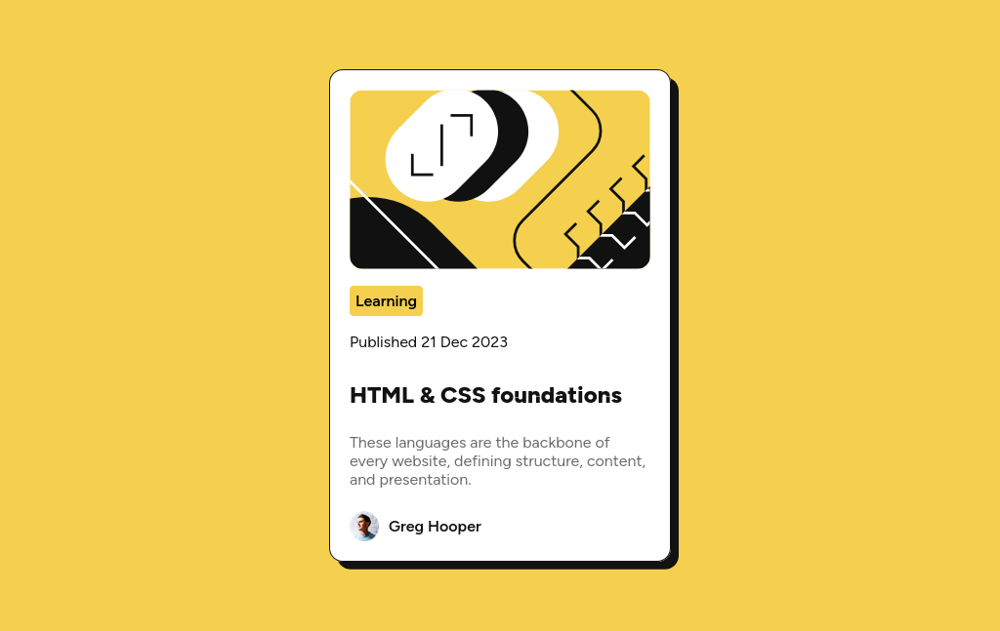

# Frontend Mentor - Blog preview card solution

This is a solution to the [Blog preview card challenge on Frontend Mentor](https://www.frontendmentor.io/challenges/blog-preview-card-ckPaj01IcS). Frontend Mentor challenges help you improve your coding skills by building realistic projects. 

## Table of contents

  - [The challenge](#the-challenge)
  - [Screenshots](#screenshots)
  - [Link](#link)
  - [Built with](#built-with)
  - [What I learned](#what-i-learned)
  - [Useful resources](#useful-resources)
- [Author](#author)
- [Acknowledgments](#acknowledgments)


### The challenge

designing a blog card with its interactive elements and responsivns


### Screenshots
## desktop preview



## phone preview


### Link


- Live Site URL: [liveSiteURL](https://your-live-site-url.com)


### Built with

- Semantic HTML5 markup
- CSS
- Flexbox

### What I learned


```css
background-color {
  h1:black;
}
```


### Useful resources

- [w3schhols](https://www.w3schools.com/css/default.asp) - This is good
- [mdn](https://developer.mozilla.org/en-US/docs/Web/CSS) - this is also good


## Author

- Frontend Mentor - [qzwas](https://www.frontendmentor.io/profile/qzwas)

## Acknowledgments

me.
